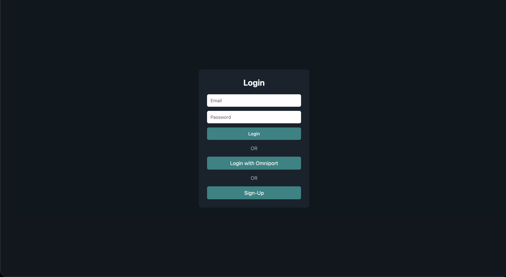
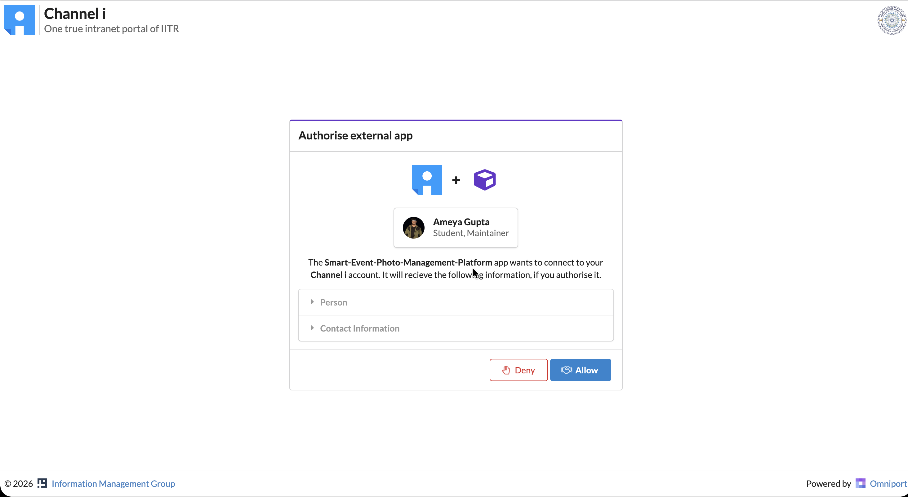
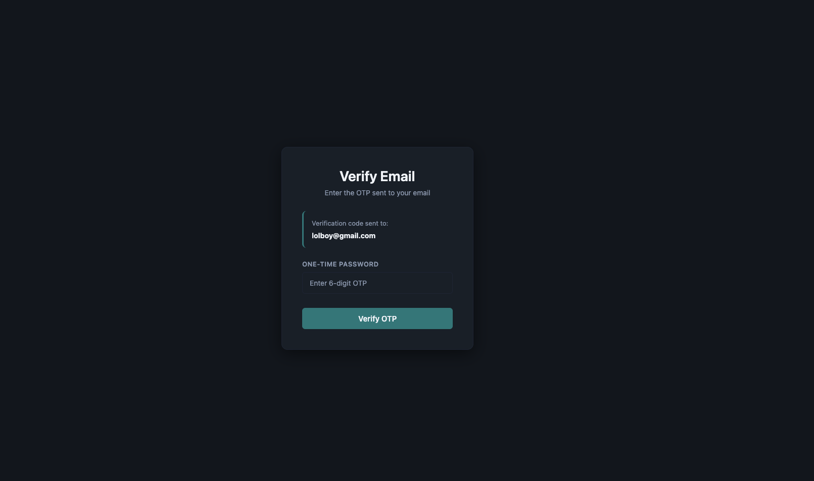
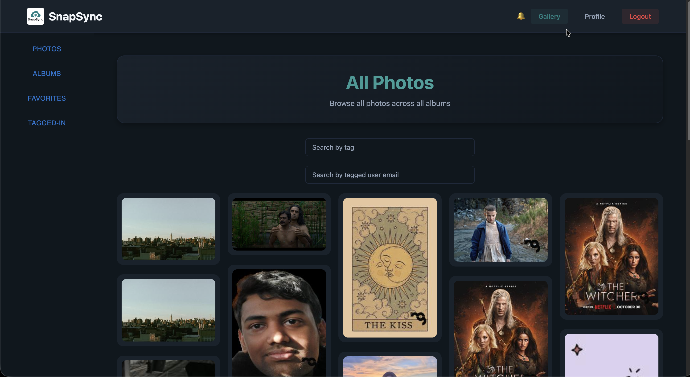
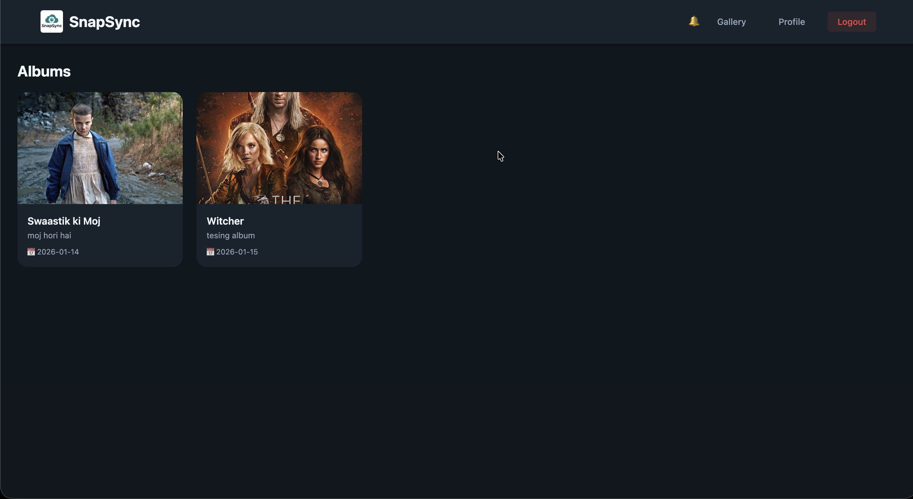
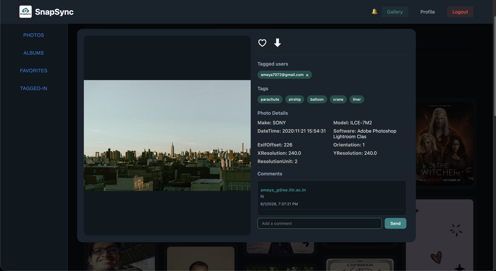
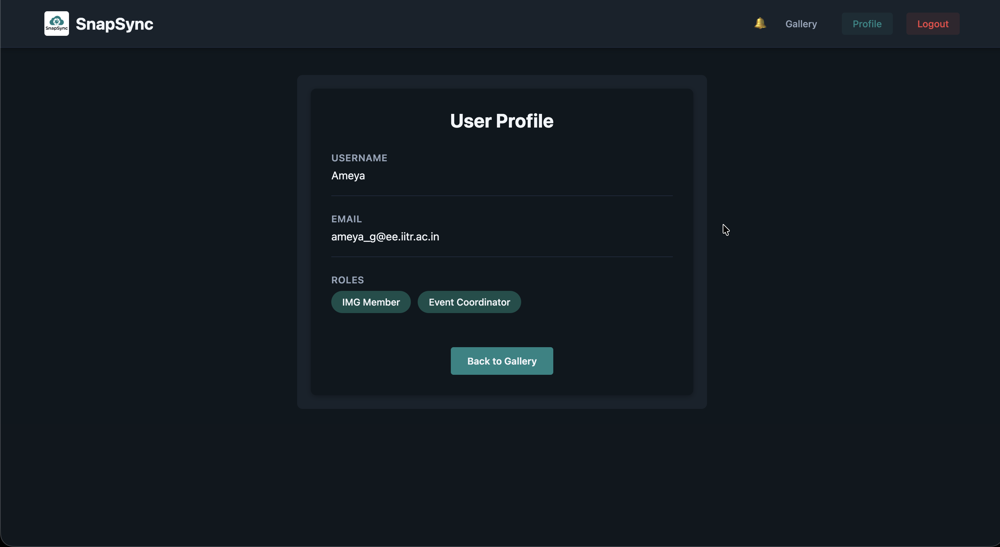

<p align="center">
  
</p>
<h1 align="center">SnapSync</h1>

**SnapSync** is a comprehensive, AI-powered web platform designed for managing, curating, and sharing event photos. With a sleek masonry web experience, instant WebSocket notifications, automated AI tag generation, and robust role-based access, it brings event galleries to life instantly.

---

## 📸 A Quick Visual Tour

| Authentication | Home Gallery Feed | Event Albums |
| :--- | :--- | :--- |
| <br><br><br>**Auth Flow**<br>Log in securely via Email OTP or Omniport OAuth | <br>**Smooth Masonry Grid**<br>Pinterest-style progressive loading galleries | <br>**Albums Hub**<br>Organize and browse curated event collections |

| Interactive Photo Detail | Real-time Updates | Photographer Dashboard |
| :--- | :--- | :--- |
| <br>**Lightbox Modal**<br>View full-res, tag users, and nest comments | <br>**Notifications**<br>Live alerts for tags and favorites | <br>**Upload Flow**<br>Batch processing, watermarks, and auto-tagging |

---

## ✨ Features You'll Love

*   **📐 Staggered Masonry Galleries:** A fluid, interlocking UI utilizing responsive CSS columns and progressive image loading (MUI Skeletons) to ensure brilliant frontend performance.
*   **🧠 AI-Powered Auto-Tagging:** Background Celery workers use `EfficientNetV2B3` to automatically scan and tag uploaded photos based on object recognition, keeping vast libraries perfectly categorized.
*   **⚡ Instant Real-time Alerts:** Get notified the second someone favorites your photo, tags you, or leaves a comment via Django Channels WebSocket integration.
*   **🔒 Secure & Role-Based:** Four distinct tiers of access (Admin, Photographer, Verified Users, Guests) combined with robust Email OTP Auth and Omniport bridging.
*   **📦 Seamless Batch Uploads:** Photographers can blindly drop massive batches of photos. The system processes thumbnails, strips EXIF data, and watermarks them entirely in the background.
*   **🗂️ Unified Smart Search:** Filter cross-referenced datasets by generated AI tags, specific users tagged, or individual event albums.

---

## 🛠️ Under the Hood (Technical Overview)

SnapSync relies on a robust distributed architecture, dividing responsibilities between a reactive React single-page app and a heavy-duty Django asynchronous environment.

### System Architecture

| System Layer | Core Responsibility |
| :--- | :--- |
| **React Web Client** | UI rendering, client-side routing, and Axios-driven state bound to an MUI presentation layer. |
| **Django REST API** | Stateless REST endpoints managing Auth, Albums, Media constraints, and Core social engagements. |
| **Realtime Gateway** | Persistent WebSocket connection layer via ASGI, fueled by Redis for live client fanout. |
| **Heavy/ML Async Workers** | Local Celery queues extracting EXIF data, resizing formats, and predicting labels using TensorFlow. |
| **Data Plane** | PostgreSQL (or SQLite locally) relation models alongside a Redis broker. |

### Technology Stack

**📱 Frontend (React Web Client)**
*   **Framework:** React 19 + Vite (for lightning-fast HMR and building).
*   **State & Routing:** `react-router-dom` v7 for declarative view transitions.
*   **API Transport:** `axios` handling JWT injection, interceptions, and error mapping.
*   **UI Components & Aesthetics:** `@mui/material` providing skeletons, stacks, and drawers mixed with responsive, raw CSS modularity.

**⚙️ Backend (Django REST Framework & Celery)**
*   **Core:** Django 6.0 operating through an ASGI gateway protocol.
*   **Web APIs:** Django REST Framework (DRF) routing heavily parameterized queries using `viewsets`.
*   **Token Security:** `djangorestframework-simplejwt` issuing stateless access and sliding sessions.
*   **Realtime Streaming:** `channels` and `channels_redis` pushing consumer packets globally.
*   **Asynchronous Processing:** `celery` executing multi-stage heavy tasks (`photos/tasks.py`) powered by `Pillow` and `numpy`/`tensorflow`.

### Backend Domain Model
*   **`User` & `Role`:** Custom user model supporting OTP emails and distinct access boundaries.
*   **`Album`:** Parent collections acting as specific events bound by dates and cover photos.
*   **`Photo`:** The core media asset storing paths for thumbnails, originals, and rich extracted JSON metadata.
*   **`Tag`:** The Many-To-Many relationship bridging human-friendly labels (AI or manual) to media.
*   **`PhotoFavorite` & `Comment`:** Social graphing structures linking photos back to engaged user instances.
*   **`Notification`:** Trigger models tracking actor/recipient behaviors relayed instantly to WebSockets.

### API Surface

**Auth & Accounts**
*   `POST /api/accounts/register/` - Register account
*   `POST /api/accounts/login/` - Login request
*   `POST /api/accounts/verify-otp/` - Validate email PIN
*   `GET /api/accounts/auth/omniport/login/` - Remote institutional OAuth entry
*   `GET /api/accounts/role/` - Confirm current session role scopes

**Albums & Media Ingestion**
*   `GET /api/albums/` - List event hubs
*   `GET /api/albums/<id>/download_all/` - Zip and serve entire album payload
*   `POST /api/photos/batch_upload/` - Trigger background celery worker queue for N files

**Search & Engagement**
*   `GET /api/photos/` - Retrieve photos (Filterable by `?tag=`, `?album=`, `?tagged_user=`)
*   `POST /api/photos/<id>/favorite/` - Toggle Favorite relation
*   `GET /api/photos/<id>/comments/` - Read/Write nested photo discussions
*   `POST /api/photos/<id>/add_user_tag/` - Mutate photo-to-user boundaries

**Realtime**
*   `WS ws/notifications/` - Connection point for live platform-wide pings

---

## 💻 Local Development

SnapSync requires Python 3.10+, Node.js 18+, and a running local **Redis** server.

### Backend Setup
Because SnapSync uses a dense machine-learning model alongside an ASGI web server, the project utilizes two virtual environments (`venv` for standard web requests, and `venv_ml` specifically handling the Celery AI-tagging consumer).

```bash
cd backend
python -m venv venv
source venv/bin/activate
pip install -r requirements.txt

# Run migrations and start the primary web gateway
python manage.py migrate
python manage.py runserver 8000
```

**Starting the Machine Learning Worker:**
In a separate terminal process:
```bash
source venv_ml/bin/activate
celery -A backend worker -l info -Q ml,celery
```

### Frontend Setup

```bash
cd frontend
npm install

# Start the Vite HMR Dev Server
npm run dev
```

### App Configuration (`.env`)
```env
SECRET_KEY=your-secret-key-here
DEBUG=True
DATABASE_URL=sqlite:///db.sqlite3

# Email OTP Relays
EMAIL_BACKEND=django.core.mail.backends.smtp.EmailBackend
EMAIL_HOST=smtp.gmail.com
EMAIL_PORT=587
```

## 📁 Repository Layout
*   `backend/` - Core settings, ASGI endpoints, and Celery app definitions.
*   `frontend/` - React frontend housing Pages, Components, and the Vite configuration.
*   `accounts/`, `albums/`, `comments/`, `notifications/`, `photos/` - Pluggable Django applications.

## 📝 Developer Notes
*   **Media Fallbacks**: The frontend safely routes missing or pending `thumbnail_img` properties back to `original_img` ensuring the CSS masonry layout never collapses while waiting for Celery background tasks to finalize.
*   **ML Lazy Loading**: The AI model (`EfficientNetV2B3`) restricts its memory initialization to the actual worker execution block, keeping the master Django thread footprint incredibly light.
EMAIL_USE_TLS=True
EMAIL_HOST_USER=your-email@gmail.com
EMAIL_HOST_PASSWORD=your-app-password

# Redis Configuration
REDIS_URL=redis://localhost:6379/0

# CORS Settings
CORS_ALLOWED_ORIGINS=http://localhost:5173
```

#### Run Migrations
```bash
python manage.py makemigrations
python manage.py migrate
```

#### Create Superuser
```bash
python manage.py createsuperuser
```

###  Frontend Setup

```bash
cd frontend
npm install
```

Create a `.env` file in the frontend directory:
```env
VITE_API_URL=http://localhost:8000/api
VITE_WS_URL=ws://localhost:8000/ws
```

###  Start Redis Server
```bash
redis-server
```

##  Running the Application

### Start Backend Services

Open **three** separate terminal windows and start the following services:

####  Django Server (Terminal 1)
```bash
source venv/bin/activate
python manage.py runserver
```

####  Default Celery Worker - Thumbnails & General Tasks (Terminal 2)
```bash
source venv/bin/activate
celery -A backend worker --loglevel=info
```

####  ML Celery Worker - AI Tagging (Terminal 3)
```bash
source venv_ml/bin/activate
celery -A backend worker -Q ml --loglevel=info
```


### Start Frontend

####  React Development Server
```bash
cd frontend
npm run dev
```

The application will be available at:
- Frontend: http://localhost:5173
- Backend API: http://localhost:8000/api
- Admin Panel: http://localhost:8000/admin

##  Project Structure

```
SnapSync/
├── accounts/              # User authentication & management
│   ├── models.py         # User, Role, EmailOTP models
│   ├── views.py          # Auth endpoints (login, signup, OTP)
│   ├── permissions.py    # Custom permissions
│   └── serializers.py    # User serializers
├── albums/               # Album management
│   ├── models.py         # Album model
│   ├── views.py          # Album CRUD operations
│   └── serializers.py    # Album serializers
├── photos/               # Photo management
│   ├── models.py         # Photo, Tag, PhotoFavorite models
│   ├── views.py          # Photo upload, tagging, favorites
│   ├── tasks.py          # Celery tasks for image processing
│   └── serializers.py    # Photo serializers
├── comments/             # Comment system
│   ├── models.py         # Comment model
│   ├── views.py          # Comment CRUD
│   └── serializers.py    # Comment serializers
├── notifications/        # Real-time notifications
│   ├── models.py         # Notification model
│   ├── consumer.py       # WebSocket consumer
│   ├── routing.py        # WebSocket routing
│   └── middleware.py     # WebSocket authentication
├── backend/              # Django project settings
│   ├── settings.py       # Main configuration
│   ├── urls.py           # URL routing
│   ├── celery.py         # Celery configuration
│   └── asgi.py           # ASGI configuration
├── frontend/             # React application
│   ├── src/
│   │   ├── components/   # Reusable components (Navbar, etc.)
│   │   ├── pages/        # Page components
│   │   │   ├── Gallery.jsx        # Photo gallery
│   │   │   ├── Albums.jsx         # Album management
│   │   │   ├── Upload.jsx         # Photographer dashboard
│   │   │   ├── Profile.jsx        # User profile
│   │   │   ├── Login.jsx          # Authentication
│   │   │   └── SignUp.jsx         # Registration
│   │   ├── services/     # API services
│   │   │   └── api.js    # Axios configuration
│   │   └── context/      # React context providers
│   ├── public/           # Static assets
│   └── package.json      # Frontend dependencies
├── media/                # Uploaded media files
│   ├── originals/        # Original photos
│   ├── thumbnails/       # Thumbnail versions
│   ├── watermarks/       # Watermarked versions
│   └── album_covers/     # Album cover images
├── manage.py             # Django management script
└── requirements.txt      # Python dependencies
```

## Key Features Implementation

### Photo Upload Flow
1. User selects photos and album
2. Photos uploaded via batch upload endpoint
3. Celery task generates thumbnails and watermarks
4. AI tags generated automatically (if configured)
5. Photos saved with metadata

### Notification System
1. WebSocket connection established on login
2. User joins personal notification channel
3. Events trigger notifications (comments, tags, favorites)
4. Real-time updates pushed to connected clients

### Search & Filter
- Tag-based search
- User-tagged search
- Album filtering
- Favorites collection
- Pagination support


##  Authentication

### JWT Token System
- Access tokens for API requests
- Refresh tokens for token renewal
- Secure WebSocket authentication

### OTP Verification
- Email-based OTP for signup
- 10-minute expiration
- Resend functionality

## API Endpoints

### Authentication
- `POST /api/accounts/signup/` - User registration
- `POST /api/accounts/verify-otp/` - OTP verification
- `POST /api/accounts/login/` - User login


### Photos
- `GET /api/photos/` - List photos (with filters)
- `POST /api/photos/batch_upload/` - Upload multiple photos
- `GET /api/photos/{id}/` - Photo detail
- `POST /api/photos/{id}/favorite/` - Add to favorites
- `POST /api/photos/{id}/add_tag/` - Add tag
- `GET /api/photos/{id}/download/` - Download photo

### Albums
- `GET /api/albums/` - List albums
- `POST /api/albums/` - Create album
- `GET /api/albums/{id}/` - Album detail
- `PUT /api/albums/{id}/` - Update album

### Comments
- `GET /api/photos/{id}/comments/` - List comments
- `POST /api/photos/{id}/comments/` - Add comment


